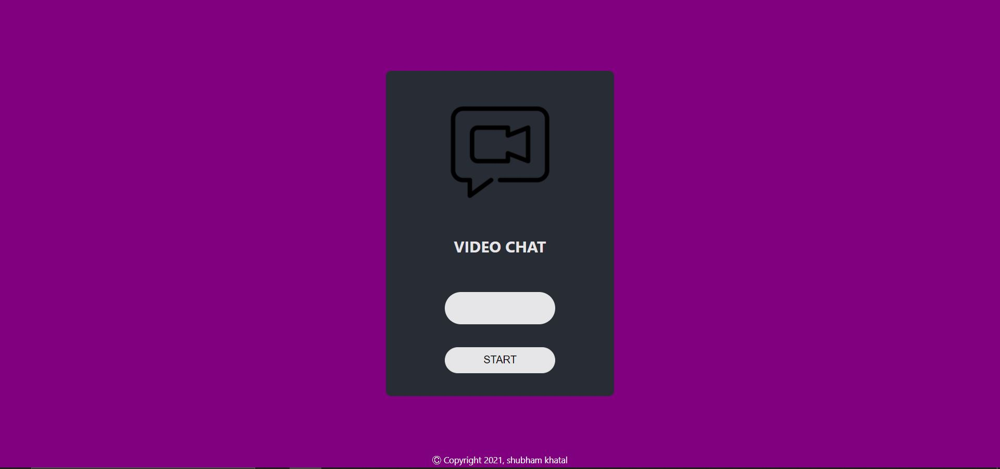
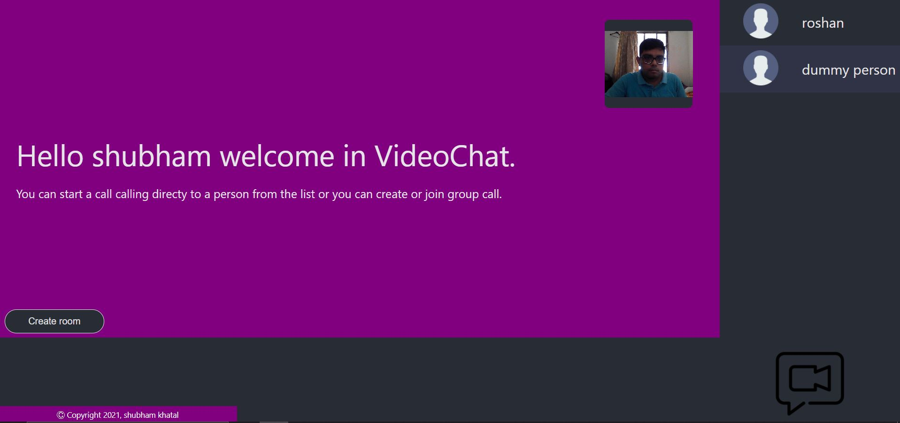
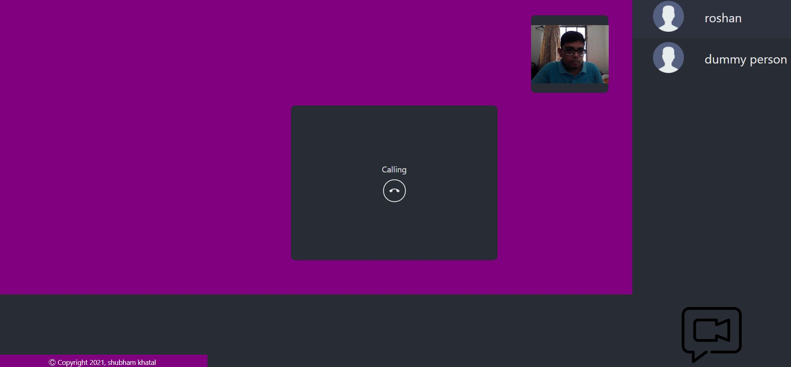
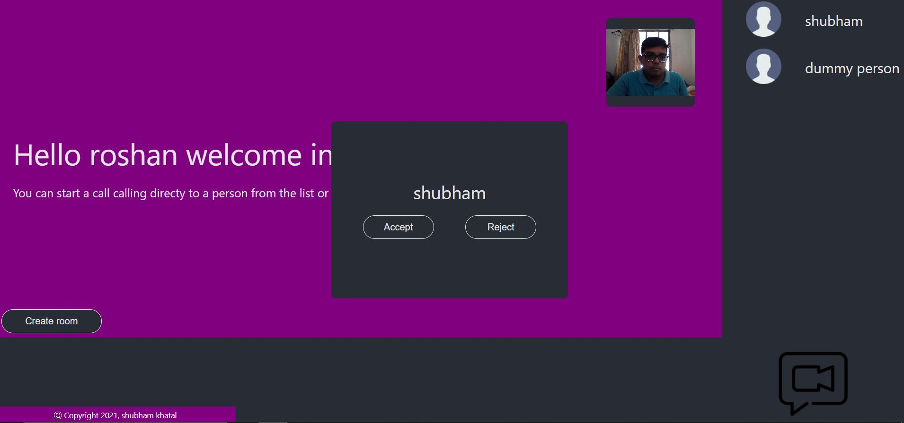
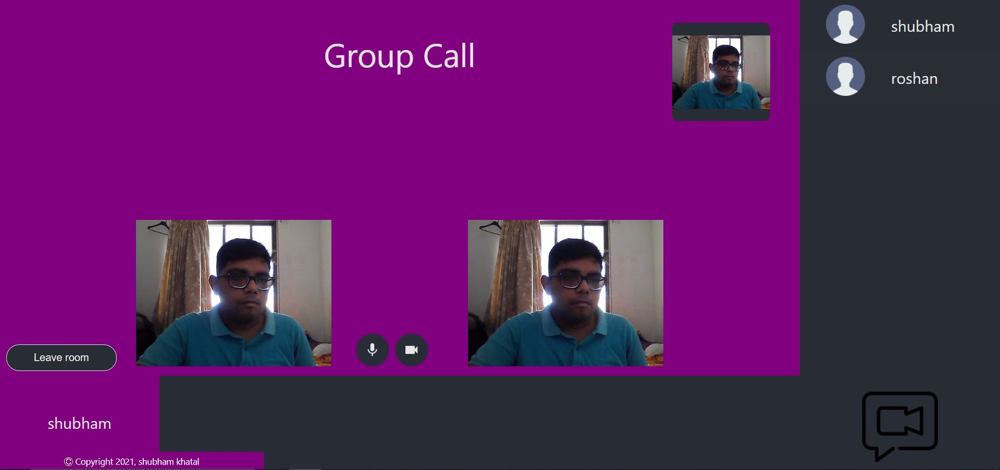

# video-chat

This project was generated with [React CLI](https://github.com/facebook/create-react-app) version 17.0.2

This project was generated with [Node.JS Open CLI ](https://github.com/oclif/oclif) version 14.16.1

# Frontend 

npx create-react-app appname

Run `npm start` for a dev server. Navigate to `http://localhost:3000/`. The app will automatically reload if you change any of the source files.

## packages and dependencies

add this script to index.html after <title> tag -> 

npm install socket.io-client

npm install --save react-router-dom

npm install --save react-redux redux

npm install redux-devtools-extension --save

npm install --save react-icons

# Backend

Run `npm start` for a dev server. Navigate to `http://localhost:5000/`

## packages and dependencies
  
npm init -> set entry point as 'server.js'
  
npm install --save express
  
npm install --save socket.io
  
npm install --save peer
  
npm install --save uuid // for unique id of group calls

## React Help
For help getting started with React, view our
[online documentation](https://reactjs.org/docs/getting-started.html), which offers tutorials, samples and guidance.

## screenshots

Login

Dashboard

Calling

Chat

Group Call

